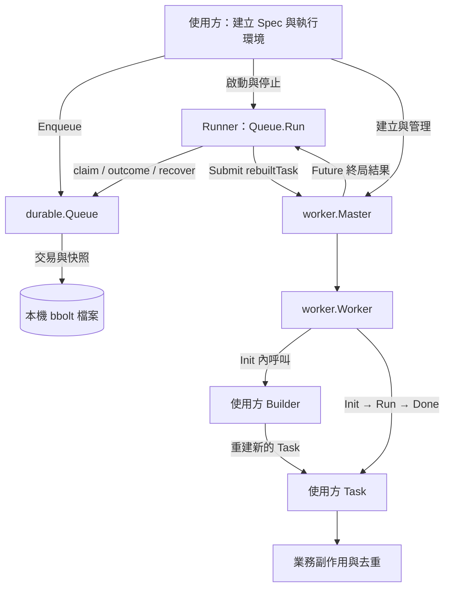
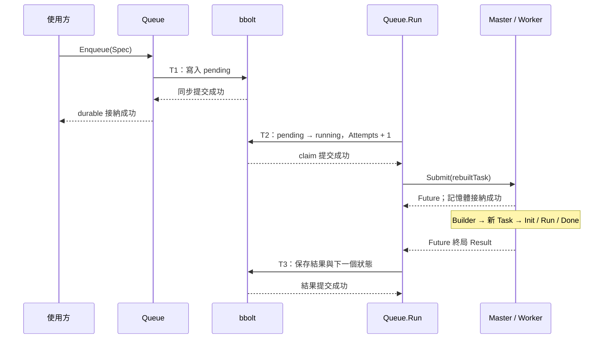
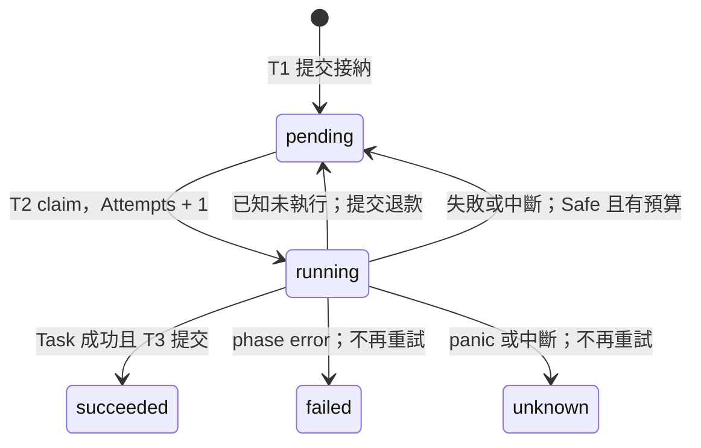

# Durable Storage 架構設計

日期：2026-10-05。狀態：**現有實作的設計審閱稿**。
實作基線：`0ab805e88a497bb4781f0d28c39bf34618ef39bc`。
版本：Go **1.27.1**、bbolt **v1.5.0**。

這份文件說明 task durable 的責任邊界、資料模型、交易、失敗與恢復語意。
目前採用本機 bbolt 後端；尚未實作的儲存替換方向另列於最後，供討論。
本文不變更既有 failed/panic Worker 移除與替換策略。

## 1. 問題與範圍

原本 Master 的佇列在記憶體裡。即使 Submit 已接納，程序結束後也無法重建其中的 Task。
這次加入一層持久化工作紀錄，讓「工作被接納」與「現在是否有 Worker 能執行」分開。

設計遵守四個條件：

1. 保存可重建的工作資料：獨立 JobID、Kind、資料版本、Payload，由使用方重建 Task。
2. 持久化提交成功才算接納。Master 派送被拒絕時，工作保留 pending。
3. 必要工作必須在 Task 成功返回前完成；完成狀態還必須另外提交到儲存。
4. 執行中斷留下不明結果；只有使用方明確宣告重複執行安全、且剩餘預算足夠，才自動重試。

範圍是**單程序、本機資料庫、一個資料庫擁有者、一個 Queue.Run**。
持久化 Job，不保存 Task 物件、Master/Worker 狀態、goroutine、context 或執行到一半的 stack。
Task 保持 `ID / Init / Run / Done` 介面，不綁定 Runner 的 parent context。

## 2. 元件與責任

Runner 是 `Queue.Run` 的職責，沒有另一個公開 Runner 型別。

| 元件 | 責任 | 擁有者 |
| --- | --- | --- |
| 使用方 | 定義 payload、版本處理、Task 完成條件、業務冪等與去重 | 應用程式 |
| `durable.Queue` | 持久化接納、快照查詢、原子領取、完成與重試狀態、開啟時恢復 | 呼叫 `Open` 的使用方 |
| `Queue.Run` | 有界派送、等待實際結果、保存結果、協調取消 | 使用方啟動與等待 |
| `Builder` | 從 Job 重建一個新的 Task；解讀 Kind、Version、Payload | 使用方 |
| `worker.Master` | 記憶體佇列、Worker 排程、容量與生命週期 | 使用方 |
| `worker.Worker` | 執行 Task phases，回報 phase error/panic/Goexit | Master 或獨立 Worker 的使用方 |
| bbolt | 本機 key-value 交易、資料檔案、檔案鎖定 | Queue |

使用方必須先替 Master 加入並啟動 Workers，且設定正數 `WithQueueCapacity`。
Queue.Run 不會自行建立、關閉 Master，或修改 Worker recovery policy。

### 套件依賴與檔案

目前依賴方向為：`應用程式 → durable → worker`，以及 `durable → bbolt`。
核心 worker 套件沒有依賴 durable；bbolt 是根模組新增的第三方依賴。

| 檔案 | 職責 |
| --- | --- |
| [job.go](../durable/job.go) | Spec、Job、Outcome、RetryPolicy、狀態與失敗重試規則 |
| [queue.go](../durable/queue.go) | bbolt 開啟、schema、接納、查詢、claim、更新與恢復 |
| [run.go](../durable/run.go) | Runner、Master Submit/Future 整合、Task 重建與結果保存 |
| [worker_task.go](../worker_task.go) | 原有 Task phases 與 Result 分類 |
| [master_queue.go](../master_queue.go) | 原有記憶體佇列與 Future 接納 |

## 3. 儲存後端選擇：bbolt

bbolt 是直接嵌入 Go 程式的 key-value 資料庫，資料保存在本機檔案。
它提供交易及檔案鎖；同時只允許一個寫入交易，可有多個讀取交易。
這些特性符合目前單一擁有者、原子領取工作的設計。
[官方交易與鎖定說明](https://pkg.go.dev/go.etcd.io/bbolt@v1.5.0#readme-transactions)

採用理由是先取得可用的本機交易機制，避免同時自行設計日誌、原子更新與恢復格式。
這是這版實作的選擇，尚未做其他後端的比較 benchmark。

實際開啟設定是 `0600` 檔案權限、取得檔案鎖最多等待一秒、正常同步提交。
沒有開放 NoSync，也沒有把 `*bolt.DB` 暴露給使用方。
NoSync 會跳過提交時的同步；官方不建議正常使用時開啟。
[官方 NoSync 說明](https://pkg.go.dev/go.etcd.io/bbolt@v1.5.0#DB)

採用這個後端的代價包括序列化寫入、本機檔案的部署與備份責任，以及 Queue 與 bbolt 的直接耦合。
同一檔案不支援多個程序共同派送；複製資料庫成另一份可寫檔案，也不會形成協調或去重機制。
[官方開啟與檔案鎖說明](https://pkg.go.dev/go.etcd.io/bbolt@v1.5.0#readme-opening-a-database)

持久化成功的實作邊界是同步交易提交成功；可靠性仍依賴檔案系統與裝置正確實作同步。
既有驗證是程序被強制終止後重新開啟，不涵蓋斷電、裝置故障或任意檔案系統行為。

## 4. 持久化資料模型

### 不可變的工作規格

| `Spec` 欄位 | 意義與規則 |
| --- | --- |
| `ID` | 獨立 JobID；空值會產生新隨機 ID。接納請求可能重送時，應由使用方提供穩定值 |
| `Kind` | 工作種類，必須非空；由 Builder 決定如何重建 |
| `Version` | Payload 的資料版本，必須大於零；由使用方負責相容與解碼 |
| `Payload` | 不透明 byte slice；Enqueue 會複製資料，儲存層不解讀業務內容 |
| `Retry` | 此工作的不可變重試規則 |

同一 JobID、相同正規化規格，Enqueue 回傳目前紀錄，包含已完成紀錄；不同規格回 `ErrConflict`。
Payload 依 byte 比較，不會把內容等價但編碼不同的 JSON 自動視為相同。

JobID 用來識別持久化工作。業務識別碼可放在 Payload，並依業務需求作為外部去重鍵。
派送 wrapper 的 `ID()` 回傳 JobID；它不呼叫使用方 Task 的 `ID()`。

### 可變執行紀錄

| `Job` 欄位 | 意義 |
| --- | --- |
| `State` | pending / running / succeeded / failed / unknown |
| `Attempts` | 已消耗的領取嘗試數；首次也計入；確定未執行的拒絕可退款 |
| `CreatedAt`、`UpdatedAt` | 建立與最後更新時間 |
| `NextAttemptAt` | 自動重試最早可再領取的時間 |
| `LastOutcome` | 最後一次結果：Phase、Error/Cause 文字、panic 文字與 stack、Interrupted 標記 |

Outcome 只保留診斷文字，不保存原本的 error 型別、panic 物件或任意 Task 回傳資料。
成功重試會覆蓋 LastOutcome；目前沒有完整 attempt history。

### 實體格式與版本

資料檔案包含兩個 bucket：

| Bucket | Key | Value |
| --- | --- | --- |
| `go-worker-durable-meta` | `schema-version` | 字串 `1` |
| `go-worker-durable-jobs` | JobID bytes | `encoding/json` 編碼的完整 Job |

Payload 在這個 JSON 外層以 base64 編碼；Retry.Delay 是 duration 的整數奈秒表示。
目前直接序列化公開 struct 欄位，沒有獨立的儲存 DTO。
因此欄位改名、型別或編碼變更，都必須視為持久化格式的變更來設計相容性。

**檔案 schema-version 與 Spec.Version 是兩個不同版本。**
前者識別儲存格式，後者識別使用方的工作資料。
Open 拒絕不支援的檔案版本；目前沒有 schema migration API。
讀取會驗證必要規格、嘗試範圍與合法狀態；這不等於驗證所有業務資料或所有可能的紀錄損壞。

## 5. 三個交易邊界

### T1：持久化接納

`Enqueue` 在一個寫入交易中完成「查 JobID → 比較已存在規格或寫入 pending」。
只有交易提交成功才回傳接納成功。這條路徑不需要 Master。

若提交完成、回覆尚未送達就中斷，使用方應以同一 JobID 查詢或重送相同規格。
若提交回傳 I/O error，也不能一概推定磁碟上沒有該紀錄；應在可重新讀取時確認。
已成功提交後，不會再因 context 剛好取消而把成功改報成取消。

### T2：原子領取

`claim` 在一個寫入交易中掃描符合 `pending && NextAttemptAt <= now` 的紀錄，
將它改成 running、Attempts 加一、清空 NextAttemptAt，再提交。
提交成功後 processor 才把 wrapper 交給 Master。

這裡的 **running 表示已領取嘗試**。它可能還在等待 Master queue 空位或 Worker handoff，
不能據此斷言 Task 已開始執行。程序在 claim 後中斷，恢復時會保守消耗這次嘗試。

多個 processor 可以並行執行 Task，但 claim 透過寫入交易序列化，只有第一個能領走同一 pending 紀錄。
這個保障依賴單一擁有者、沒有外部改寫紀錄，以及下述 Run 等待規則。

### T3：結果與後續狀態

Runner 等待 Future 的真實終局結果，再於一個寫入交易保存結果：

- Task 成功：保存 succeeded。
- Task phase error：保存 failed，或依安全與預算規則直接保存 pending 及 NextAttemptAt。
- Panic/Goexit：保存 unknown，或依同一規則直接保存 pending 及 NextAttemptAt。

結果、State、Attempts 的既有值、重試時間一起提交。
失敗後要重試時，不會先提交一個 failed，再以另一個交易改回 pending。
完成提交失敗會令 Run 回傳錯誤；之後需查詢實際已提交狀態，並恢復剩餘 running 紀錄。

正常成功的工作會經過接納、claim、結果三個寫入交易；開啟初始化與恢復另計。
Task 執行與外部副作用都在這些儲存交易之外，避免在 Task 執行期間佔住寫入交易。

## 6. 狀態轉移與預算

failed 與 unknown 是這版的終局狀態，不會單純因重啟或相同 ID 再次 Enqueue 就重派。

`RetryPolicy.MaxAttempts` 包含首次，零預設為一；Delay 不得為負。
MaxAttempts 大於一時必須宣告 Safe。Safe 只表示使用方承諾冪等或去重，儲存層不會替業務實作保證。
重試從一個新的 Task 的 Init 開始，涵蓋整段生命週期。

| 預算 | 控制對象 | 保存位置 |
| --- | --- | --- |
| `durable.RetryPolicy` + Job.Attempts | 同一 Job 最多可消耗多少嘗試，跨程序重啟保留 | Job 紀錄 |
| `worker.RecoveryPolicy` | 同一 Worker 位置的替換次數與滾動窗口 | 原有 Master/Worker 記憶體狀態 |

Worker 替換成功不會退還已執行的 Task 嘗試；Task phase error 也不會直接消耗 Worker 替換預算。
容量不足導致確定未執行的拒絕，可提交退款、保留 pending，之後由使用方恢復 Master 再啟動 Run。

### 如何判定確定未執行

Submit 直接回 error 表示沒有接納 wrapper。
Submit 已接納、後來派送失敗的 Future，則依目前核心 Result 合約分類：
`Err != nil && Phase == "" && Err != ErrWorkerPanic`。

核心在執行 Task 方法時會保留對應 Phase；panic/Goexit 一律回 ErrWorkerPanic。
因此上述分支視為執行前拒絕，提交 pending 與 Attempts 減一，再把派送錯誤回傳。
這是與現有 Result 合約的耦合；未來更改 Result 分類時必須連同 durable 核對。
退款提交若失敗，也不能當成已成功回到 pending。

## 7. 中斷點與恢復

Open 取得檔案鎖、初始化或驗證 schema 後，會把所有殘留 running 視為 interrupted。
下一次 Run 開始前也會做同一處理，涵蓋上一輪 Run 執行完成但結果提交失敗的情況。

恢復在一個寫入交易內先收集 running 紀錄，再修改：Safe 且有剩餘預算則 pending；其餘 unknown。
它不會根據 Worker 的舊狀態推定工作有沒有副作用，也不增加額外的嘗試數。

| 中斷／失敗位置 | 可觀察到的持久化狀態 | 處理與限制 |
| --- | --- | --- |
| 明確取消於 T1 寫入前 | 未接納 | 使用方可重新提出接納 |
| T1 提交中 I/O error | 可能不確定 | 以原 JobID 確認，不能直接假設未寫入 |
| T1 提交後、接納回覆前 | pending 或之後的狀態 | 同 JobID、同規格查詢／重送 |
| 接納後、claim 前 | pending，Attempts 尚未增加 | 之後可派送 |
| claim 後、Task 開始前中斷 | running | 無法證明未執行，依 interrupted 規則保守處理 |
| Master 明確拒絕派送 | 成功退款後 pending | Attempts 退款；Run 回傳派送錯誤 |
| Task phase error／panic 已保存 | failed／unknown，或可重試 pending | 按已提交規則處理；不回滾外部副作用 |
| 副作用已完成、T3 未提交 | running | 結果不明；可能重派已做完的工作 |
| T3 提交後、程序退出或觀察回覆遺失 | succeeded | Runner 跳過；相同 Enqueue 不建立新工作 |

**副作用完成與 durable 完成是兩個提交點。**
目前沒有跨 bbolt 與外部系統的共同交易。
使用方的去重必須跟副作用具有所需的原子性；先寫獨立標記或事後寫標記，都可能形成另一個中斷空窗。

這版承諾保存接納與已提交結果，並依明確規則安排有上限的重試。
它不保證每個已接納工作最終成功，也不保證外部副作用 exactly-once。
甚至不能一概承諾至少執行一次：預設一個嘗試的工作若在 claim 提交後、Submit 前中斷，
恢復時會成為 unknown，可能連 Init 都沒有執行。這是保守處理不明結果與有限預算的代價。
未宣告 Safe 或預算耗盡時，unknown 會保留供使用方調查；目前沒有人工 reconcile／重開終局工作的 API。

## 8. Context、並行與關閉

Enqueue／Job／Jobs 的 context 在進入交易後檢查；掃描也檢查。
它無法強制打斷 bbolt 寫鎖等待或已開始的提交，所以 deadline 不是儲存呼叫的硬性返回期限。

Run 內部 context 用來協調 processor 與 Master 的接納等待，不傳入 Builder 或 Task。
Submit 成功後用 `Future.Wait(context.Background())` 等真實結果；取消 Runner 不放棄已接納工作。
任何 processor 遇到派送或儲存錯誤，會取消其他 processor 的新接納，再等待所有 processor 返回。
已領取但未被接納的工作會嘗試退款；已接納的工作仍取得結果並嘗試保存。

`concurrency` 限制領取／派送／等待結果中的工作數，跟 Master queue capacity 是兩個不同上限。
沒有工作可領取時等待記憶體 changed 通知或 50ms timer；通知只是喚醒提示，不是持久化資料。
Task error 已成功保存通常不會停止整個 Runner；派送或儲存錯誤則會。

Run 返回、釋放 running flag 前會等待所有 processor，因此在正常 API 與同步完成契約下，
同一 JobID 的受管理 Task 嘗試不會因取消 Runner 而重疊執行。
這個保證限於 Task 同步方法及已等待的必要子工作，不表示舊 Worker 的診斷收尾已結束，
也不表示遠端副作用已消失。Task 自行留下的背景工作不在這個保證內。

擁有者關閉順序是取消並等待 Run、關閉自己擁有的 Master、最後 Close Queue。
active Run 期間 Close 回 ErrRunning。Task、Builder、diagnostic formatter 或 logger 不返回，
都可能延後等待；這版不會強制終止它們。

## 9. 已知取捨與未實作能力

| 設計點 | 現況與影響 |
| --- | --- |
| 儲存耦合 | Queue 直接持有 `*bolt.DB`，沒有可替換的 Store 注入；使用 durable 就接受這個後端選擇 |
| 層次責任 | Queue 同時承擔儲存、領取規則與 Runner 入口；目前容易使用，但後端替換不能只改 Open |
| 排程與效能 | claim 掃描包含終局紀錄，沒有 ready-state 索引；沒有 FIFO、公平性或大規模吞吐保證 |
| 容量與留存 | 沒有 durable record 數／payload 大小的產品上限，也沒有刪除、retention 或 compaction API |
| 不明結果處置 | unknown 可查詢但沒有 reconcile API；只自動重試事先宣告安全且有額度的工作 |
| 診斷資料 | 只有最新結果，沒有不可變的 attempt history 或型別化業務結果 |
| 相容與運維 | 沒有 schema migration、備份恢復流程或斷電驗證；需要依使用情境另定義 |
| 時間來源 | NextAttemptAt 使用牆鐘時間；沒有承諾對任意時鐘跳動保持精確重試延遲 |

先前 [worker pool benchmark](../benchmarks/README.md) 測的是記憶體排程，
不包含 durable 的同步交易與掃描成本，不能用它推定 durable throughput。

## 10. 儲存邊界的後續決策草案

**本節是待決策項目，不是已實作功能或新的後端選定。**
如果 durable 只提供本機 bbolt queue，保留目前具體實作能減少抽象與設定成本。
如果需求是由使用方選擇儲存、或與既有業務資料共同提交，就需要先拆開持久化契約與 bbolt 實作。

替換後端時至少需要維持下列語意；只有 Get／Put 型的 CRUD 不足以表達原子領取與結果提交。

| 語意操作 | 必須維持的條件 |
| --- | --- |
| 接納／查重 | 同 JobID 規格衝突檢查與新紀錄寫入必須原子，成功回覆必須對應提交 |
| 領取到期工作 | 同一工作只能被一個有效擁有者領取，Attempts 與狀態同時更新 |
| 保存結果／重試決策 | Outcome、下一狀態與重試時間一起提交 |
| 確定未執行的退款 | Pending 與嘗試退款一起提交，不能退款其他執行嘗試 |
| 中斷恢復 | 先確立舊執行者不再擁有該工作，再套用結果不明的規則 |
| 查詢 | 回傳已提交的獨立快照，保持 JobID 與版本語意 |

若出現具體的第二個後端需求，再由消費儲存能力的 durable 一側定義最小 interface，
由實作端回傳具體型別、由使用方組裝；介面不應外洩 `bolt.Tx`、bucket 或另一家資料庫的交易型別。
多程序需求還需 ownership／lease／fencing 等額外設計，不能僅把本機檔案鎖換成一個遠端 client。
這些方向都尚未實作。

下一次引入新的工具、第三方套件或儲存後端前，先向使用方說明需求、選項、限制與依賴影響。
這份文件先供審閱現有設計，再決定是否保留 bbolt，或另立可替換儲存的需求。

## 11. 驗證證據與文件基線

已核對此基線的 Enqueue、claim、recoverInterrupted、Queue.Run、execute、changeJob，
以及 Master Submit、Future.Wait 與 Worker 的 Result 分類原始碼。
圖譜協助定位；同名 Run 的圖節點無法完整代表 Queue.Run，因此該路徑另以原始碼核對。

| 行為 | 測試證據 |
| --- | --- |
| 持久化／重開、同 ID 查重／衝突、payload 獨立快照、檔案鎖 | [queue_test.go](../durable/queue_test.go) |
| 並行領取、全部 phases、取消後等待、Master 拒絕退款 | [run_test.go](../durable/run_test.go) |
| Task 與 Worker 預算分離、panic／Goexit／Builder 錯誤、完成提交失敗 | [run_test.go](../durable/run_test.go) |
| 強制終止於接納後、執行中、工作完成但結果未提交、重試決策已提交 | [crash_test.go](../durable/crash_test.go) |
| 使用方重建 Task、等待持久化成功 | [example_test.go](../durable/example_test.go) |

實作回合已通過 build、vet、root race/shuffle，以及 durable race/shuffle 重複三輪。
這次工作是 commit 與架構文件整理，沒有重新執行上述 runtime 測試。

completion-gap 測試先確認指定檔案副作用完成，再阻擋完成交易並終止程序，
驗證該中斷點的 fixture 去重；沒有驗證任意中斷點下所有業務副作用的去重。
測試通過也不代表所有並行交錯、斷電行為或分散式持久化已被證明。

公開 API 的實際使用方式見 [durable README](../durable/README.md)。
